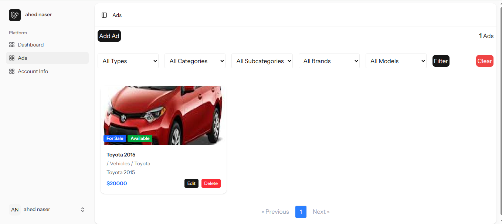
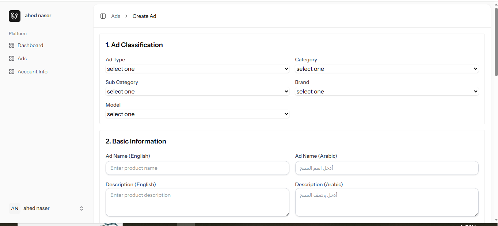
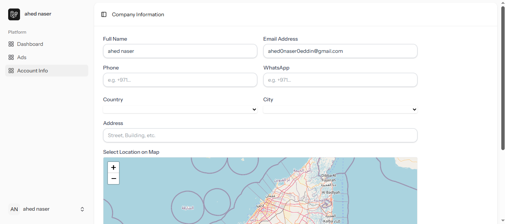
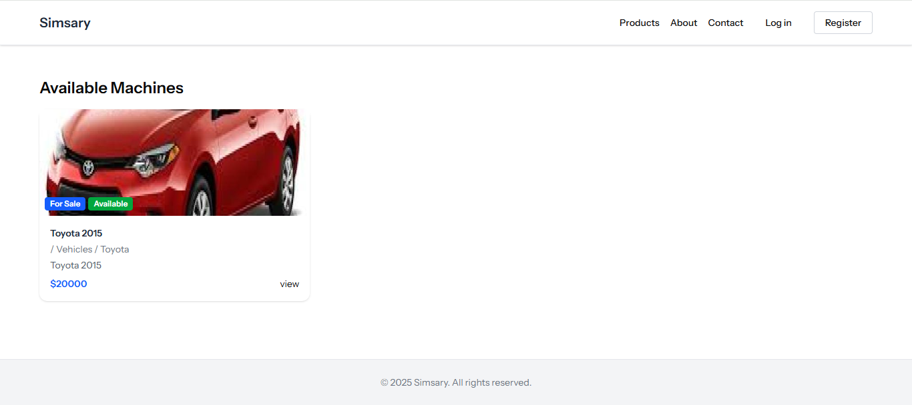

# 🚀 Classified Ads Platform

A full-stack Laravel + Inertia.js application for creating, managing, and viewing classified ads with multilingual support, advanced filtering, media uploads, and SEO optimization.

---

## 📌 Features

### **Owner Control Panel**
- 🔐 **Authentication** — Login & Register
- 📋 **Ads Management**
  - View all ads with advanced filters
  - Create ads with:
    - Ad type, category, subcategory
    - Brand, model, price
    - Name & description (English & Arabic)
    - Features list
    - Media upload (images, videos)
  - Edit existing ads
- 👤 **Profile Management**
  - Edit personal info
  - Detect location for location-based ad display
- ⚙ **SEO Auto-Generation**
  - Automatically generate meta description & keywords from ad details
- 🛡 **Permissions & Roles** — Using Spatie Laravel Permission

---

### **Public Website**
- 🏠 **Home Page**
  - Latest ads section
- 📄 **Ad Details Page**
  - Full details with images, videos, and features

---

## 🛠 Tech Stack

**Backend**
- Laravel 10+
- Spatie Laravel Permission (roles & permissions)

**Frontend**
- Inertia.js
- TailwindCSS (optional styling layer)

**Database**
- MySQL

**Others**
- Laravel Mix / Vite
- SEO optimization

---
## 📸 Screenshots

### 🏠 Ads Index Page(Owner control panel)


### 📄 Create Ad Page(Owner control panel)


### 👤 Profile Page (Owner control panel)


###  Home Page (Website)


###  Ad Details Page(website)


## 📂 Installation & Setup

1. **Clone the repository**
   ```bash
   git clone https://github.com/ahed666/ads-platform.git
   cd ads-platform
2. **Install dependencies**
    composer install
    npm install
3. **Create .env file**
    cp .env.example .env
4. **Generate app key**
    php artisan key:generate
6. **Run migrations & seeders**
    php artisan migrate --seed
7. **Run the app**
    php artisan serve
    npm run dev
📄 License
This project is licensed under the MIT License — feel free to use and modify it for personal or commercial projects.

✨ Author
Ahed Naser Eddin

GitHub: ahed666

Email: ahed0naser0eddin@gmail.com